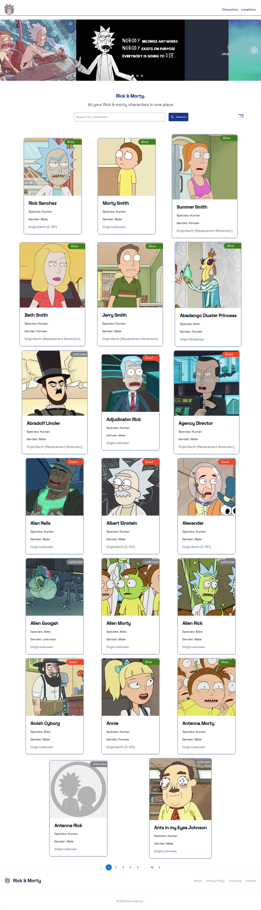

# RICK AND MORTY WEB APPLICATION
- version 1.0.0

# Authors

- Evans Rutto

## Description

This is a web application that displays all rick and morty characters and locations from the [this open API](https://rickandmortyapi.com/) to fetch the required data.

## Livelink:

(https://rickmorty.pages.dev/)


## screenshot:



## About This application

## Menu Component
- Contains  a `Menu` component that displays two options, one for `Characters` and one for `Locations`.
- The `Menu` menu is located at the top upon launching the application

## Characters Page

- Contains a `Characters` page that displays a list of [`characters`](https://rickandmortyapi.com/documentation/#character) cards in a responsive manner.
- Each `CharacterCard`  displays the `image`, `name`, `status`, `species`, `gender`, and `origin.name` values.


## Locations Page

- Contains a `Locations` page that displays a list of [`locations`](https://rickandmortyapi.com/documentation/#location). 
- Each `LocationCard`  displays the `name`, `type`, and `dimension`, and `number_of_residents` values.
- W
## Search and Filter Component
- Implements filtering of the [catalog](https://rickandmortyapi.com/documentation/#filter-characters) by `status`, `species`, and `gender`.


## Technologies used
- Vite 
- ReactJS 
- Saas-styling
- React Routing Library
- Flowbite-react
- Material UI
- NodeJS (v16), and npm


## Environment Setup

- Start by **cloning**  the project template into your repository.

- Install all required dependencies by running command 
 ``` npm install ```

- Start the application by running command
 ``` npm run dev ```


## Known Bugs

- 1) None

## Support and contact details

If you have any suggestion or contributions about this project, you can reach out to 
- email: @ruttoevans001@gmail.com

## License
- Copyright 2022 Rick-morty
- Permission is hereby granted, free of charge, to any person obtaining a copy of this software and associated documentation files (the "Software"), to deal in the Software without restriction, including without limitation the rights to use, copy, modify, merge, publish, distribute, sublicense, and/or sell copies of the Software, and to permit persons to whom the Software is furnished to do so, subject to the following conditions:
- The above copyright notice and this permission notice shall be included in all copies or substantial portions of the Software.
- THE SOFTWARE IS PROVIDED "AS IS", WITHOUT WARRANTY OF ANY KIND, EXPRESS OR IMPLIED, INCLUDING BUT NOT LIMITED TO THE WARRANTIES OF MERCHANTABILITY, FITNESS FOR A PARTICULAR PURPOSE AND NONINFRINGEMENT. IN NO EVENT SHALL THE AUTHORS OR COPYRIGHT HOLDERS BE
LIABLE FOR ANY CLAIM, DAMAGES OR OTHER LIABILITY, WHETHER IN AN ACTION OF CONTRACT, TORT OR OTHERWISE, ARISING FROM, OUT OF OR IN CONNECTION WITH THE SOFTWARE OR THE USE OR OTHER DEALINGS IN THE SOFTWARE.


# Rick-morty-app